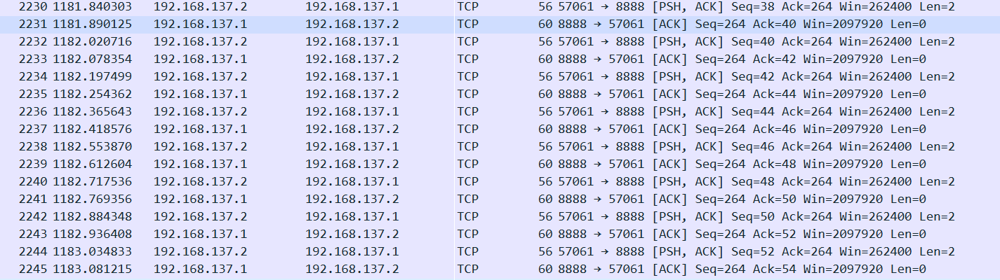
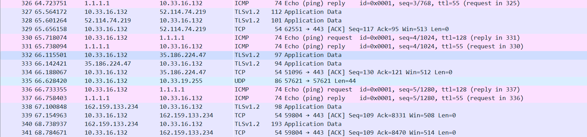
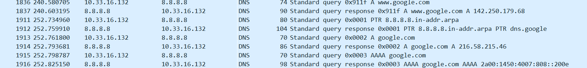

# TP1 - Premier pas réseau
# Sommaire
- [TP1 - Premier pas réseau](#tp1---premier-pas-réseau)
- [Sommaire](#sommaire)
- [Déroulement et rendu du TP](#déroulement-et-rendu-du-tp)
- [I. Exploration locale en solo](#i-exploration-locale-en-solo)
  - [1. Affichage d'informations sur la pile TCP/IP locale](#1-affichage-dinformations-sur-la-pile-tcpip-locale)
    - [En ligne de commande](#en-ligne-de-commande)
    - [En graphique (GUI : Graphical User Interface)](#en-graphique-gui--graphical-user-interface)
  - [2. Modifications des informations](#2-modifications-des-informations)
    - [A. Modification d'adresse IP (part 1)](#a-modification-dadresse-ip-part-1)
- [II. Exploration locale en duo](#ii-exploration-locale-en-duo)
  - [1. Prérequis](#1-prérequis)
  - [2. Câblage](#2-câblage)
  - [Création du réseau (oupa)](#création-du-réseau-oupa)
  - [3. Modification d'adresse IP](#3-modification-dadresse-ip)
  - [4. Utilisation d'un des deux comme gateway](#4-utilisation-dun-des-deux-comme-gateway)
  - [5. Petit chat privé](#5-petit-chat-privé)
  - [6. Firewall](#6-firewall)
- [III. Manipulations d'autres outils/protocoles côté client](#iii-manipulations-dautres-outilsprotocoles-côté-client)
  - [1. DHCP](#1-dhcp)
  - [2. DNS](#2-dns)
- [IV. Wireshark](#iv-wireshark)
- [Bilan](#bilan)

# Déroulement et rendu du TP

- Groupe de 2 jusqu'à 4 personnes. Il faut au moins deux PCs avec une prise RJ45 (Ethernet) par groupe
- Un câble RJ45 (fourni) pour connecter les deux PCs
- **Un compte-rendu par personne**
  - vu que vous travaillez en groupe, aucun problème pour copier/coller les parties à faire à plusieurs (tout le [`II.`](#ii-exploration-locale-en-duo))
  - une bonne partie est à faire de façon individuelle malgré tout (tout le [`I.`](#i-exploration-locale-en-solo) et le [`III.`](#iii-manipulations-dautres-outilsprotocoles-côté-client))
- Le rendu doit :
  - comporter des réponses aux questions explicites
  - comporter la marche à suivre pour réaliser les étapes demandées :
    - en ligne de commande, copier/coller des commandes et leurs résultat : **JE NE VEUX AUCUN SCREEN DE LIGNE DE COMMANDE**
    - en interface graphique, screenshots ou nom des menus où cliquer (sinon ça peut vite faire 1000 screenshots)
  - par exemple, pour la partie `1.A.` je veux le la commande tapée et le résultat
  - de façon générale, tout ce que vous faites et qui fait partie du TP, vous me le mettez :)

**⚠️ ⚠️ Désactivez votre firewall pour ce TP. ⚠️ ⚠️**

# I. Exploration locale en solo

## 1. Affichage d'informations sur la pile TCP/IP locale

### En ligne de commande

En utilisant la ligne de commande (CLI) de votre OS :

**🌞 Affichez les infos des cartes réseau de votre PC**

```
PS C:\Users\Bastien> ipconfig /all
   Description. . . . . . . . . . . . . . : Intel(R) Wi-Fi 6 AX201 160MHz
   Adresse physique . . . . . . . . . . . : 6C-94-66-1F-BE-8B
   Adresse IPv4. . . . . . . . . . . . . .: 10.33.17.9(préféré) 
   ```
- j'en ai pas 

**🌞 Affichez votre gateway**

- utilisez une commande pour connaître l'adresse IP de la passerelle (ou *gateway*) de votre carte WiFi
```
PS C:\Users\Bastien> ipconfig
Passerelle par défaut. . . . . . . . . : 10.33.19.254
```

> La passerelle (ou *gateway*), c'est le **routeur** de votre réseau. Pendant que vous réalisez le TP ce sera donc le routeur d'YNOV (ou votre box, si vous faites le TP chez vous). On l'appelle passerelle, car il vous permet de "passer" vers d'autre réseau : Internet en l'occurence :)

**🌞 Déterminer la MAC de la passerelle**

- à l'aide d'une commande, affichez votre table ARP, et déterminez ainsi l'adresse MAC de la passerelle
```
PS C:\Users\Bastien> arp -a 10.33.19.254

Interface : 10.33.17.9 --- 0xc
  Adresse Internet      Adresse physique      Type
  10.33.19.254          00-c0-e7-e0-04-4e     dynamique
```

> **La table ARP est aussi appelée table de voisinnage.** Elle contient l'adresse MAC de toutes les personnes avec qui vous avez déjà discuté sur le réseau. La passerelle vous permet d'accéder à Internet donc si vous êtes allés sur Internet, vous avez discuté avec elle !

### En graphique (GUI : Graphical User Interface)

En utilisant l'interface graphique de votre OS :  

**🌞 Trouvez comment afficher les informations sur une carte IP (change selon l'OS)**

- trouvez l'IP, la MAC et la gateway pour l'interface WiFi de votre PC
```
recherche avec la touche windows
information système
cliquer sur composants 
cliquer sur réseau
cliquer sur carte 
toute les infos sont affichées
```

> Dans le but de maîtriser votre OS, il est nécessaire de savoir repérer et interagir avec ces informations.

## 2. Modifications des informations

### A. Modification d'adresse IP (part 1)  

🌞 Utilisez l'interface graphique de votre OS pour **changer d'adresse IP** :

```
recherche avec la touche windows
panneau de configuration 
modifier les parametres de la carte 
wifi 
proprietes
configurer protocole internet version 4 (TCP/iPv6)
```

- changez l'adresse IP de votre carte WiFi pour une autre
- ne changez que le dernier octet
  - par exemple pour `10.33.1.10`, ne changez que le `10`
  - valeur entre 1 et 254 compris

🌞 **Il est possible que vous perdiez l'accès internet.** Que ce soit le cas ou non, expliquez pourquoi c'est possible de perdre son accès internet en faisant cette opération.
```
l'adresse ip que nous utilisons est libre donc elle fonctionne, dans le cas inverse nous n'aurions plus internet
```

---

- **NOTE :** si vous utilisez la même IP que quelqu'un d'autre, il se passerait la même chose qu'en vrai avec des adresses postales :
  - deux personnes habitent au même numéro dans la même rue, mais dans deux maisons différentes
  - quand une de ces personnes envoie un message, aucun problème, l'adresse du destinataire est unique, la lettre sera reçue
  - par contre, pour envoyer un message à l'une de ces deux personnes, le facteur sera dans l'impossibilité de savoir dans quelle boîte aux lettres il doit poser le message
  - ça marche à l'aller, mais pas au retour

# II. Exploration locale en duo

Owkay. Vous savez à ce stade :

- afficher les informations IP de votre machine
- modifier les informations IP de votre machine
- c'est un premier pas vers la maîtrise de votre outil de travail

On va maintenant répéter un peu ces opérations, mais en créant un réseau local de toutes pièces : entre deux PCs connectés avec un câble RJ45.

## 1. Prérequis

- deux PCs avec ports RJ45
- un câble RJ45
- **firewalls désactivés** sur les deux PCs

PS C:\Users\Bastien> nslookup 231.34.113.12
Serveur :   dns.google
Address:  8.8.8.8

*** dns.google ne parvient pas à trouver 231.34.113.12 : Non-existent 

# II. Exploration locale en duo

## 3. Modification d'adresse IP

🌞 **Modifiez l'IP des deux machines pour qu'elles soient dans le même réseau**

- paramètres
- réseau et internet
- etat
- modifier les options d'adaptateur
- propriété
- protocole internet version 4

🌞 **Vérifier à l'aide d'une commande que votre IP a bien été changée**
```
Carte Ethernet Ethernet 2 :
   Suffixe DNS propre à la connexion. . . :
   Description. . . . . . . . . . . . . . : Realtek PCIe GbE Family Controller
   Adresse physique . . . . . . . . . . . : 48-9E-BD-4E-44-F4
   DHCP activé. . . . . . . . . . . . . . : Non
   Configuration automatique activée. . . : Oui
   Adresse IPv6 de liaison locale. . . . .: fe80::1805:dfff:b745:8fc6%21(préféré)
   Adresse IPv4. . . . . . . . . . . . . .: 10.10.10.1(préféré)
   Masque de sous-réseau. . . . . . . . . : 255.255.255.0
   Passerelle par défaut. . . . . . . . . :
```
🌞 **Vérifier que les deux machines se joignent**
```
PS C:\Users\Utilisateur> ping 10.10.10.6

Envoi d’une requête 'Ping'  10.10.10.6 avec 32 octets de données :
Réponse de 10.10.10.6 : octets=32 temps=2 ms TTL=128
Réponse de 10.10.10.6 : octets=32 temps=3 ms TTL=128
Réponse de 10.10.10.6 : octets=32 temps=2 ms TTL=128
Réponse de 10.10.10.6 : octets=32 temps=2 ms TTL=128

Statistiques Ping pour 10.10.10.6:
    Paquets : envoyés = 4, reçus = 4, perdus = 0 (perte 0%),
Durée approximative des boucles en millisecondes :
    Minimum = 2ms, Maximum = 3ms, Moyenne = 2ms
```

🌞 **Déterminer l'adresse MAC de votre correspondant**
```
PS C:\Users\Utilisateur> arp -a 10.10.10.6

Interface : 10.10.10.1 --- 0x15
  Adresse Internet      Adresse physique      Type
  10.10.10.6            08-8f-c3-52-58-34     dynamique
```

## 4. Utilisation d'un des deux comme gateway


🌞**Tester l'accès internet**
```
PS C:\Users\Utilisateur> ping 1.1.1.1

Envoi d’une requête 'Ping'  1.1.1.1 avec 32 octets de données :
Réponse de 1.1.1.1 : octets=32 temps=26 ms TTL=54
Réponse de 1.1.1.1 : octets=32 temps=23 ms TTL=54

Statistiques Ping pour 1.1.1.1:
    Paquets : envoyés = 2, reçus = 2, perdus = 0 (perte 0%),
Durée approximative des boucles en millisecondes :
    Minimum = 23ms, Maximum = 26ms, Moyenne = 24ms
```

🌞 **Prouver que la connexion Internet passe bien par l'autre PC**
```
PS C:\Users\Utilisateur> tracert google.com

Détermination de l’itinéraire vers google.com [142.250.75.238]
avec un maximum de 30 sauts :

  1     1 ms     1 ms     1 ms  kzenoo [192.168.137.1]
  2     *        *        *     Délai d’attente de la demande dépassé.
  3     5 ms     6 ms     5 ms  10.33.19.254
```

## 5. Petit chat privé

🌞 **sur le PC *serveur*** avec par exemple l'IP 192.168.1.1

```
C:\netcat\netcat-1.11> .\nc.exe -l -p 8888
hello
salut
how are you ajd
ca va
```

🌞 **sur le PC *client*** avec par exemple l'IP 192.168.1.2
```
PS C:\Users\Utilisateur\Documents\B1_info\fonction_reseau\netcat-1.11> .\nc.exe 192.168.137.1 8888
hello
salut
ca va
```

🌞 **Visualiser la connexion en cours**

```
PS C:\Windows\system32> netstat -a -n -b | Select-String 8888

  TCP    192.168.137.1:8888     192.168.137.2:62178    ESTABLISHED

 ```

🌞 **Pour aller un peu plus loin**

```

PS C:\Windows\system32> netstat -a -n -b | Select-String 8888

  TCP    0.0.0.0:8888           0.0.0.0:0              LISTENING


PS C:\Windows\system32> netstat -a -n -b | Select-String 8888

  TCP    192.168.137.1:8888     0.0.0.0:0              LISTENING
 ```
## 6. Firewall

🌞 **Activez et configurez votre firewall**

- autoriser les `ping`
```
PS C:\Windows\system32> netsh advfirewall firewall add rule name="ICMP Allow incoming V4 echo request" protocol=icmpv4:8,any dir=in action=allow
Ok.
```
```
PS C:\Users\Utilisateur\Documents\B1_info\fonction_reseau\netcat-1.11> ping 192.168.137.1

Envoi d’une requête 'Ping'  192.168.137.1 avec 32 octets de données :
Réponse de 192.168.137.1 : octets=32 temps=4 ms TTL=128
Réponse de 192.168.137.1 : octets=32 temps=3 ms TTL=128
Réponse de 192.168.137.1 : octets=32 temps=3 ms TTL=128
Réponse de 192.168.137.1 : octets=32 temps=3 ms TTL=128

    Paquets : envoyés = 4, reçus = 4, perdus = 0 (perte 0%),
    Minimum = 3ms, Maximum = 4ms, Moyenne = 3ms
```

- autoriser le traffic sur le port qu'utilise \
  -> pare-feu Windows defender avec fonctions avancées de sécurité \
 -> règles de trafic entrant \
 -> nouvelle règle \
 -> port \
 -> TCP et ports locaux spécifiques : 8888 \
 -> autoriser la connexion \
 -> domaine + privé + public \
 -> nom de la règle : " port 8888 ouvert"

 ```
 PS C:\Users\Utilisateur\Documents\B1_info\fonction_reseau\netcat-1.11> .\nc.exe 192.168.137.1 8888
hello
coucou
```
  
# III. Manipulations d'autres outils/protocoles côté client

## 1. DHCP

Bon ok vous savez définir des IPs à la main. Mais pour être dans le réseau YNOV, vous l'avez jamais fait.  

C'est le **serveur DHCP** d'YNOV qui vous a donné une IP.

Une fois que le serveur DHCP vous a donné une IP, vous enregistrer un fichier appelé *bail DHCP* qui contient, entre autres :

- l'IP qu'on vous a donné
- le réseau dans lequel cette IP est valable

🌞**Exploration du DHCP, depuis votre PC**

```
Carte réseau sans fil Wi-Fi :

   Suffixe DNS propre à la connexion. . . :
   Description. . . . . . . . . . . . . . : Intel(R) Wi-Fi 6 AX201 160MHz
   Adresse physique . . . . . . . . . . . : 6C-94-66-1F-BE-8B
   DHCP activé. . . . . . . . . . . . . . : Oui
   Configuration automatique activée. . . : Oui
   Adresse IPv6 de liaison locale. . . . .: fe80::5cc4:c719:6cd6:9db9%9(préféré)
   Adresse IPv4. . . . . . . . . . . . . .: 10.33.16.132(préféré)
   Masque de sous-réseau. . . . . . . . . : 255.255.252.0
   Bail obtenu. . . . . . . . . . . . . . : mercredi 5 octobre 2022 11:00:24
   Bail expirant. . . . . . . . . . . . . : jeudi 6 octobre 2022 11:00:24
   Passerelle par défaut. . . . . . . . . : 10.33.19.254
   Serveur DHCP . . . . . . . . . . . . . : 10.33.19.254
   IAID DHCPv6 . . . . . . . . . . . : 141333606
   DUID de client DHCPv6. . . . . . . . : 00-01-00-01-2A-C3-A6-C8-6C-94-66-1F-BE-8B
   Serveurs DNS. . .  . . . . . . . . . . : 8.8.8.8
                                       8.8.4.4
                                       1.1.1.1
   NetBIOS sur Tcpip. . . . . . . . . . . : Activé
```

- afficher l'adresse IP du serveur DHCP du réseau WiFi YNOV
- cette adresse a une durée de vie limitée. C'est le principe du ***bail DHCP*** (ou *DHCP lease*). Trouver la date d'expiration de votre bail DHCP
- vous pouvez vous renseigner un peu sur le fonctionnement de DHCP dans les grandes lignes. On aura un cours là dessus :)

> Chez vous, c'est votre box qui fait serveur DHCP et qui vous donne une IP quand vous le demandez.

## 2. DNS

Le protocole DNS permet la résolution de noms de domaine vers des adresses IP. Ce protocole permet d'aller sur `google.com` plutôt que de devoir connaître et utiliser l'adresse IP du serveur de Google.  

Un **serveur DNS** est un serveur à qui l'on peut poser des questions (= effectuer des requêtes) sur un nom de domaine comme `google.com`, afin d'obtenir les adresses IP liées au nom de domaine.  

Si votre navigateur fonctionne "normalement" (il vous permet d'aller sur `google.com` par exemple) alors votre ordinateur connaît forcément l'adresse d'un serveur DNS. Et quand vous naviguez sur internet, il effectue toutes les requêtes DNS à votre place, de façon automatique.

🌞** Trouver l'adresse IP du serveur DNS que connaît votre ordinateur**
```
PS C:\Users\Bastien> nslookup google.com
Serveur :   dns.google
Address:  8.8.8.8
```

🌞 Utiliser, en ligne de commande l'outil `nslookup` (Windows, MacOS) ou `dig` (GNU/Linux, MacOS) pour faire des requêtes DNS à la main

- faites un *lookup* (*lookup* = "dis moi à quelle IP se trouve tel nom de domaine")
  - pour `google.com`
```
  PS C:\Users\Bastien> nslookup google.com
Serveur :   dns.google
Address:  8.8.8.8

Réponse ne faisant pas autorité :
Nom :    google.com
Addresses:  2a00:1450:4007:808::200e
          142.250.201.174
```


  - pour `ynov.com`
```
  PS C:\Users\Bastien> nslookup ynov.com
Serveur :   dns.google
Address:  8.8.8.8

Réponse ne faisant pas autorité :
Nom :    ynov.com
Addresses:  2606:4700:20::ac43:4ae2
          2606:4700:20::681a:ae9
          2606:4700:20::681a:be9
          104.26.10.233
          104.26.11.233
          172.67.74.226
  ```
  - interpréter les résultats de ces commandes
  ```
  ne fais pas autorité car l'adresse était stocké en cache, la réponse de ne viens pas de celui qui sait
  la commande renvoit l'ip de l'adresse demandé
  ``` 
- déterminer l'adresse IP du serveur à qui vous venez d'effectuer ces requêtes
```
8.8.8.8
```
- faites un *reverse lookup* (= "dis moi si tu connais un nom de domaine pour telle IP")
  - pour l'adresse `78.73.21.21`
```
  PS C:\Users\Bastien> nslookup 78.73.21.21
Serveur :   dns.google
Address:  8.8.8.8

Nom :    78-73-21-21-no168.tbcn.telia.com
Address:  78.73.21.21
```
  - pour l'adresse `22.146.54.58`
```
PS C:\Users\Bastien> nslookup 231.34.113.12
Serveur :   dns.google
Address:  8.8.8.8

*** dns.google ne parvient pas à trouver 231.34.113.12 : Non-existent d
```
  - interpréter les résultats
  ```
  Cela nous renvoie les noms de domaines
  ```
  - *si vous vous demandez, j'ai pris des adresses random :)*

# IV. Wireshark

**Wireshark est un outil qui permet de visualiser toutes les trames qui sortent et entrent d'une carte réseau.**

On appelle ça un **sniffer**, ou **analyseur de trames.**


Il peut :

- enregistrer le trafic réseau, pour l'analyser plus tard
- afficher le trafic réseau en temps réel

**On peut TOUT voir.**

Un peu austère aux premiers abords, une manipulation très basique permet d'avoir une très bonne compréhension de ce qu'il se passe réellement.

➜ **[Téléchargez l'outil Wireshark](https://www.wireshark.org/).**

🌞 Utilisez le pour observer les trames qui circulent entre vos deux carte Ethernet. Mettez en évidence :

- un `ping` entre vous et votre passerelle

- un `netcat` entre vous et votre mate, branché en RJ45
- une requête DNS. Identifiez dans la capture le serveur DNS à qui vous posez la question.

- prenez moi des screens des trames en question
- on va prendre l'habitude d'utiliser Wireshark souvent dans les cours, pour visualiser ce qu'il se passe

# Bilan

**Vu pendant le TP :**

- visualisation de vos interfaces réseau (en GUI et en CLI)
- extraction des informations IP
  - adresse IP et masque
  - calcul autour de IP : adresse de réseau, etc.
- connaissances autour de/aperçu de :
  - un outil de diagnostic simple : `ping`
  - un outil de scan réseau : `nmap`
  - un outil qui permet d'établir des connexions "simples" (on y reviendra) : `netcat`
  - un outil pour faire des requêtes DNS : `nslookup` ou `dig`
  - un outil d'analyse de trafic : `wireshark`
- manipulation simple de vos firewalls

**Conclusion :**

- Pour permettre à un ordinateur d'être connecté en réseau, il lui faut **une liaison physique** (par câble ou par *WiFi*).  
- Pour réceptionner ce lien physique, l'ordinateur a besoin d'**une carte réseau**. La carte réseau porte une adresse MAC  
- **Pour être membre d'un réseau particulier, une carte réseau peut porter une adresse IP.**
Si deux ordinateurs reliés physiquement possèdent une adresse IP dans le même réseau, alors ils peuvent communiquer.  
- **Un ordintateur qui possède plusieurs cartes réseau** peut réceptionner du trafic sur l'une d'entre elles, et le balancer sur l'autre, servant ainsi de "pivot". Cet ordinateur **est appelé routeur**.
- Il existe dans la plupart des réseaux, certains équipements ayant un rôle particulier :
  - un équipement appelé *passerelle*. C'est un routeur, et il nous permet de sortir du réseau actuel, pour en joindre un autre, comme Internet par exemple
  - un équipement qui agit comme **serveur DNS** : il nous permet de connaître les IP derrière des noms de domaine
  - un équipement qui agit comme **serveur DHCP** : il donne automatiquement des IP aux clients qui rejoigne le réseau
  - **chez vous, c'est votre Box qui fait les trois :)**